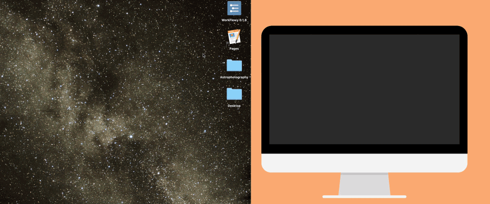
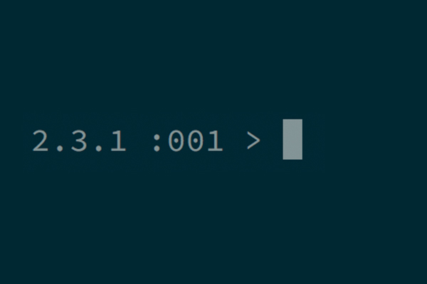

# Hello, World

Most programming guides will start like this

```
print “Hello World!”
Hello World!
```

They’ll then introduce all the various parts you need to be able to program:

- Variables
- Functions
- Loops
- Conditionals

This curriculum is a little different. In it, you’ll form a good model of 

- What a ‘program’ is: a tiny, temporary world that comes into being in your computer, before disappearing when it finishes
- What ‘program objects’ are: the denizens of this tiny, temporary world
- How all the things above act to make the world a living, breathing place
- How to construct sophisticated worlds with interacting entities inside

We’ll be constructing a simple Todo list. Eventually, you’ll be able to run `todo show` from the console (Terminal), and see:

```
Good evening! You have 2 Todos to complete:
* Wash the dog
* Wash the car

You have completed 2 Todos:
* Learn to code
* Make a Todo list program
```

You’ll also be able to add todos, with `todo add Put the dog in the car`:

```
Todo added: Put the dog in the car
```

And complete todos, with `todo complete Wash the dog`:

```
Todo completed: Wash the dog

You have 2 Todos left to complete:
* Wash the car
* Put the dog in the car

You have completed 3 Todos:
* Learn to code
* Make a Todo list program
* Wash the dog
```

Although we’re going to build your understanding of programming in a different way to normal, we’re still going to start with ‘Hello World!’. Why? Because ‘Hello World’ is a small, minimal program, and we as programmers always try to build the smallest, most minimal things we can get away with.

The difference for us is that we’re actually going to introduce a World, of sorts, in this chapter. So we really are saying, ‘Hello World!’


## Programs are worlds

There are two things required to run a program: a machine, and some code.


* **The code** is a _set of instructions to the machine for how to set up a program_.
* **The machine** is the _place in which this program lives and breathes_. Computers are machines.

When I think of a program, I think of a flat world, with things happening inside it. Objects live in this world. 

For instance, let’s start with a program we all know: Microsoft Word. When we click on the ‘W’ icon to open Word, the following world comes into being inside your computer:



> I'm using Apple's word processor, Pages – but it's basically the same as Word.

This world contains objects. In Microsoft Word, some obvious examples of these objects might be things we can see:

- bits of text
- buttons that make text bold or italic
- the cursor

Some less-obvious examples might be:

- files that are open right now
- something tracking changes in the document so you can Undo and Redo

These objects, obvious and non-obvious, can interact with one another in set ways: we can save text to and load text from files, for instance. We can move our cursor around the text we have loaded into the world right now. And, of course, we can exit the program – which destroys the world.

<microsoft word gif demonstrating interaction above>

Moreover, the world is _itself_ an object: in Ruby, it's called the 'main Object'. It’s like our real-life Universe: although everything that exists does so within the Universe, the Universe is itself a thing. It’s conceivable that some higher power could ‘exit the Universe’: with pretty catastrophic results for all us objects within it.

Ruby is a language for writing code – setting up a program, or world – and it’s also an environment in which that world can exist. Whenever we run a Ruby program, we set up a main object, and a bunch of other objects too. For the next few chapters, we’ll be exploring these objects, who they are, and how they work, using a special kind of Ruby program called a **REPL (or ‘Read–Evaluate–Print Loop’)**. 

When we run a REPL program, we:

1. set up the Ruby world, and 
2. we get the ability to write Ruby code to modify that world on-the-fly.

You could think (2) as being an 'interactive window' into the program world. You are given a 'prompt', which waits for you to type instructions for the Ruby world. The main Ruby prompt is called **IRB**. It looks like this:



> IRB stands for ‘interactive Ruby’.

You can start the Ruby world and the REPL by typing `irb` from the console, and executing with Return. 

* _**Start an interactive Ruby program using `irb`.**_

<details>
  <summary>See how I'd do it</summary>
  <p>
    
```
$> irb
 >
```

> In code examples, I'll include the IRB prompt as a chevron ('`>`'). You don't need to enter the chevron into your IRB. If I'm typing in the console (Terminal), rather than in IRB, I'll include the prompt as a dollar-chevron `$>`. Again, you don't need to enter the dollar-chevron into the console.

  </p>
</details>
<p></p>

## Destroying worlds

In `irb`, we can type `exit` and hit return, to close the program. What happens to our world? It disappears: everything that ever existed inside it is gone. When you next run the REPL program `irb`, you'll get a brand-new world.

[Next module](./2_variables_and_statements.md)

