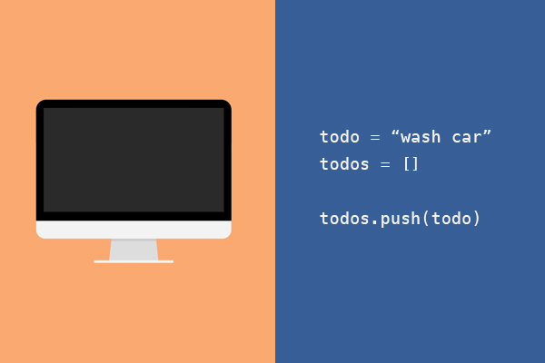
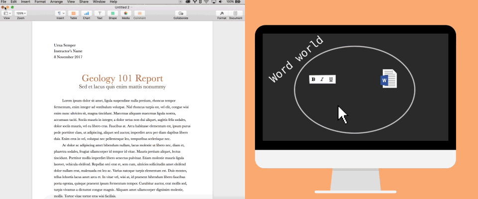

# Hello, World

Most programming guides will start like this

```irb
> print “Hello World!”
=> Hello World!
```

They’ll then introduce all the various parts you need to be able to program:

- Variables
- Functions
- Loops
- Conditionals

This curriculum is a little different. In it, you’ll form a good model of 

- What a ‘program’ is: a tiny, temporary world that comes into being in your computer, before disappearing when it finishes
- What ‘program objects’ are: the denizens of this tiny, temporary world
- How all the things above act to make the world a living, breathing place
- How to construct sophisticated worlds with interacting entities inside

Although we’re going to build your understanding of programming in a different way to normal, we’re still going to start with ‘Hello World!’. Why? Because ‘Hello World’ is a small, minimal program, and we as programmers always try to build the smallest, most minimal things we can get away with.

The difference for us is that we’re actually going to introduce a World, of sorts, in this chapter. So we really are saying, ‘Hello World!’

## Programs are worlds

There are two things required to run a Ruby program: some code, and an interpreter.



* **The code** is a _set of instructions to the interpreter_.
* **The interpreter** is the _thing that executes these instructions_. A computer is a machine containing interpreters.

When I think of a program, I think of a flat world, with things happening inside it. This world lives and breathes inside a computer. Objects live in this world. 

For instance, let’s start with a program we all know: Microsoft Word. When we click on the ‘W’ icon to open Word, the following world comes into being inside your computer:


> I'm using Apple's word processor, Pages – but it's basically the same as Word.

This world contains objects. In Microsoft Word, some obvious examples of these objects might be things we can see:

- bits of text
- buttons that make text bold or italic
- the cursor

Some less-obvious examples might be:

- files that are open right now
- something tracking changes in the document so you can Undo and Redo

These objects, obvious and non-obvious, can interact with one another in set ways: we can save text to and load text from files, for instance. We can move our cursor around the text we have loaded into the world right now. And, of course, we can exit the program – which destroys the world.



> Each of these objects is following a set of instructions.

Moreover, the world is _itself_ an object: in Ruby, it's called the 'main object' (`main`). The main object is like our real-life Universe: although everything that exists does so within the Universe, the Universe is itself a thing. It’s conceivable that some higher power could ‘exit the Universe’: with pretty catastrophic results for all us objects within it.

Ruby is a language for writing code – setting up a program, or world – and it’s also an environment in which that world can exist. Whenever we run a Ruby program, we set up a main object, and a bunch of other objects too. For the next few chapters, we’ll be exploring these objects, who they are, and how they work, using a special kind of Ruby program called a **REPL (or ‘Read–Evaluate–Print Loop’)**. 

When we run a REPL program, we:

1. set up the Ruby world, and 
2. we get the ability to write Ruby code to modify that world on-the-fly.

You could think (2) as being an 'interactive window' into the program world. You are given a 'prompt', which waits for you to type instructions for the Ruby world. 

> I like to imagine that, when I'm using a REPL, I'm pretending to be an object in the object world. I can send instructions to other objects, and they'll send me answers to my instructions.

The main Ruby prompt is called **IRB**. It looks like this:


> IRB stands for ‘interactive Ruby’.

You can start the Ruby world and the REPL by typing `irb` from the console, and executing with Return. 

* _**Start an interactive Ruby program using `irb`.**_

%accordion%See how I'd do this%accordion%
    
```
$> irb
 >
```

%/accordion%


## A note about code examples

There are two kinds of code examples in this curriculum. In some of them, you can play with the Ruby code in-browser. These look like this:

```eval-ruby
1 + 1
```

> You can and should play with the interactive code samples. Try changing one number to another, or one sign around, or adding extra things. Each time, try to develop a picture of what's happening in the program world when you make changes.

Another kind of code example is non-interactive. They look like this:

```
$> irb
 >
```

In these code examples, I'll include the IRB prompt as a chevron ('`>`'). You don't need to enter the chevron into your IRB. If I'm typing in the console (Terminal), rather than in IRB, I'll include the prompt as a dollar-chevron `$>`. Again, you don't need to enter the dollar-chevron into the console.

> Each line of the interactive code examples can be typed into IRB as a separate instruction. In Ruby, generally speaking, a newline (↵) means 'execute this instruction'. IRB allows you to send line-by-line instructions: interactive examples allow you to queue up instructions to send one-after-the-other.

When I want to illustrate something but I don't want the code to be executed, I'll put a hashtag (`#`) in front of the code:

```ruby
# This line of code will not be executed.
```

> In Ruby, putting a `#` at the beginning of an instruction (a 'line of code') means it won't be executed. Lines like this are used to give extra information about the lines of code coming after them. They're called **comments**.

## Destroying worlds

In `irb`, we can type `exit` and hit return, to close the program. What happens to our world? It disappears: everything that ever existed inside it is gone. When you next run the REPL program `irb`, you'll get a brand-new world.

## Loading pre-written worlds

Closing `irb` with `exit` will result in the program world being destroyed. Next time we start `irb`, we'll generate a fresh new world. Anything we've done to alter our program world will be wiped, and we'll have to start over.

Instead of starting from scratch each time, we can use a **file** to store the instructions we would have to type into the REPL. When we **require** (import) the file into the program, it'll be **executed** automatically. The result of executing these pre-written instructions is the world we want – and the REPL, if we want to use that, can provide an interactive window into that world.

> a set of instructions stored up one after the other (for instance, in a file), is called a **procedure**. A real-world cake recipe (take a bowl, add flour, add eggs, add sugar, turn on oven to 200, cook for 20 minutes, remove mixture, cool) is an example of a procedure. Each step is executed one-at-a-time. The whole recipe can be 'reloaded' to create a ready-to-go cake at any time.

<gif of world being created from a file>

To move your instructions into a file, we must make a Ruby-specific file (just as a Microsoft Word document has the file suffix `.doc`, so Ruby has the suffix `.rb`), and then write our instructions into it, just as we would the REPL:

1. _**Create a Ruby file. Call the file `hello_world.rb`.**_
2. _**Open this file in a text editor, such as [Sublime Text](https://www.sublimetext.com/).**_
3. _**Inside the file, type a line: `puts 1 + 1`.**_
4. _**Save the file.**_
5. _**Launch IRB, immediately requiring this file using `irb -r ./hello_world.rb`.**_
6. _**Run the file directly using `ruby ./hello_world.rb`**_
7. _**Describe the difference between the two.**_

## Getting output from a program

The REPL treats us, the programmer, as if we were 'inside' the program world. That is to say: we can instruct objects in the program world directly, as if we too were an object.

When we tell an object to do something, it always responds. This is the foundation of [Chapter 3](../chapter3/README.md), which goes into detail about how this 'messaging' works.

However, when we tell our computer to load a pre-written world – to run a program from a file – we don't get to live in that world alongside the objects. It's created, it does its thing, then it disappears (unless you expressly tell it to stick around).

So how can we get a view into this world while it exists – while the program's running? We can use a special command: `puts`. It stands for 'put string'. 

> We'll find out more about strings in [Chapter 5](../chapter5/README.md).

`puts` is really only useful to us when we run pre-written code (for example, by running `ruby hello_world.rb` like we did above). In fact, something weird goes on when we try to use it in the REPL, or in these interactive code examples:

```eval-ruby
puts 1 + 1
```

When we get to 'messages and interfaces', we'll think more about this. For now, it's enough to know that **`puts` can be used to print information from a program without a REPL**.
