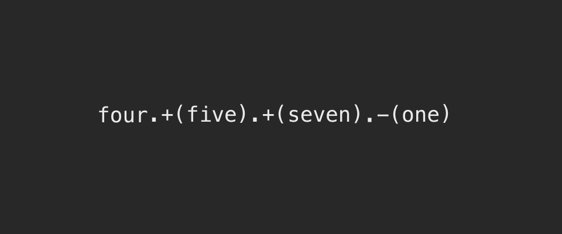

# Messages and Interfaces

Our REPL provides us with a window through which we can interact with the program world. But how does that interaction happen? And what kinds of interaction are allowed?

## Messages

We interact with the program world by sending it **messages**. In response to our messages, objects **return** something (the 'return value'). When we're using the REPL, the program world treats us, the programmer, as if we were just another object in the object world.


Here's a visual depiction of us, the programmer, interacting with the REPL by requesting an object by name (`one`). Provided that we have defined this variable, the program world goes and fetches the object referenced by that name:


Now that we have the object referenced by `one`, we can send it messages directly. For instance, we can send it the '`+`' message, telling it to add another number to itself, and return the result:


Or, we can send the object referenced by `one` other messages, like `integer?`, to tell us about itself:

<gif showing me executing `1.integer?` and the resulting messages that are sent in the world>

Note the difference between those two messages we just sent to the object referenced by `1`:

```ruby
1 + 2
1.integer?
```

In both cases, we're sending a message to an object – but in the first case, we've got a space before the message `+`, making the statement look like a regular sum. In the second case, we've got this crazy dot thing between the object and the message. What gives?

## Dot syntax

What might surprise you is that the second way is, secretly, the only way to send messages to objects in Ruby. The `.` (**dot**) means 'send this object a message'. `1.integer?` means "send the object referenced by `1` a message asking it to answer if it's an integer or not."

In the first case, `1 + 2`, Ruby is actually translating this to `1.+(2)`. We say, and see, 'one plus two', and Ruby translates that to "send the object referenced by `1` a message to add itself to the object referenced by `2`."

## Arguments

Sometimes, a messaged object knows everything it needs to know to answer the message. For instance: `1.integer?` is perfectly answerable by `1` all on its own: it doesn't need any other object to tell us whether it's an integer.

Other times, a messaged object needs to know something else to answer the message. We couldn't get away with just saying `1.+`, for example: `1` would right ask _"`+` what? What am I mean to add with?"_. In that case, we can give the object a reference to another object required to fulfil the message. We call this second object an **argument**:

```eval-ruby
# 2 is the argument
1.+(2)
```

```
> # five is the argument
> four.+(five)
> => 9
```

Just like dot syntax is formally-correct, it's formally-correct to wrap an argument inside **parentheses** `()` (I've done that above). But, sometimes, that's optional:

```eval-ruby
# 2 is the argument
1 + 2
```

Here's another example of optional parentheses:

```irb
> # five is the argument
> four + five
=> 9
```

> So why does Ruby permit us to use this non-dot-syntaxy way of sending messages? In short, convenience. Ruby was designed to read as similarly to English as possible. These sorts of 'edge cases' – where Ruby syntax differs from normal – are rare. They're referred to as 'syntactic sugar' – because they are, quite literally, _sweeteners_ on top of the rules of the language.

- _**Convert your numeral calculator to use dot syntax with parentheses.**_

> We'll be using dot syntax with parentheses for now, so we can get used to writing formally-correct code.

## What happens when we send an object a message?

For every message that can be received by an object, that object has some sort of **procedure** defined on it. A procedure is a _set of instructions that is executed by the object, one after the other_. 

We'll go into much more detail about how to write these procedures later.

Like many program objects, these procedures usually have names. A named procedure is called a **method**. Sending an object a message to execute a procedure is referred to as _calling a method_:


> An interface is a list of all the things an object can do: all the object's procedures. In other words, an interface is a list of object methods.

## Making random numbers

If we don't specify an object to send a message to, by default it'll be sent to `main`, the main program object:

```eval-ruby
+(3)
```

The main program object can respond to a few messages by executing some useful procedures. In other words, the main object has some useful methods. You've already met one: `puts`. Another useful one is `rand`:

```eval-ruby
rand
```

Each time you run `rand`, you'll get a random float between zero and one. If you give `rand` an integer argument:

```eval-ruby
integer = 6

rand(integer)
```

You'll get a random number between zero and `integer - 1` (so here, `0` to `5`).

- _**Write a program that rolls a six-sided die and returns the result. This program should be runnable from the command line.**_

## Asking objects to return other objects: integers and floats

#### Introducting floats

Something pretty weird happens when we do division with our numeral calculator:

```irb
> nine./(two)
=> 4
```

What's going on here? 

The problem is that _integer objects don't understand decimal points, so they round them down_: 9/2 is 4.5, which the integer referenced by `nine` rounds down to 4.

To use decimal points, we need to use a different kind of number: a **float** (short for 'floating point number' – that is, the decimal point can float anywhere along the line of numbers).

Here are some example floats:

```
 1.6
28.004
-0.41
```

Floats have a very specific purpose in programs: to do very fine calculations usually involving division, and as such they're rarely-used (as [Chris Pine points out](https://pine.fm/LearnToProgram/chap_01.html), who wants to look at 7.4 emails, or browse 1.8 webpages, or listen to 5.24 of their favorite songs?). But we need floats now!

#### Asking integers to return floats

When we send an integer object the message `to_f`, the integer object says "OK! You're looking for a float object with the same value as me", and returns that corresponding float object:

```eval-ruby
4.to_f
```

We can now divide this returned float object by another integer (or another float):

```eval-ruby
4.to_f./(5)
```

Of course, this is going to get pretty ugly for our poor numeral calculator. We don't want to be jamming `to_f` on the first numeral every time we want to do division; it makes the code super-hard to read:

```irb
> four.to_f./(five)
=> 0.8
```

- _**Figure out how to rewrite your numeral calculator to achieve the following functionality (without dot syntax):**_

```irb
> four / five
=> 0.8
```

## Interfaces

What determines the possible messages that can be sent to a particular object? If we wanted to, could we try:

```irb
> 1.any_message_i_want
=> ???
```

Of course not. Objects have a limited number of possible messages they can be sent. In the case above, we'd get a useful error message telling us this:

```eval-ruby
1.any_message_i_want
```

In fact, the very set of messages to which an object can respond mostly determines what an object _is_ in Ruby. For instance, if an object responded to a set of messages like this:

```irb
> object.bark
=> "woof!"
> object.wag_tail
=> "wag wag wag"
> object.dream_about_chasing_things
=> "*twitches*"
```

Then you could pretty reasonably figure out what that object is (a dog, if you were guessing).

Likewise, if an object responded to messages like this without throwing errors:

```irb
> object.walk
=> "waddle waddle"
> object.quack
=> "waak waak"
```

You could guess that the object is a duck. This principle is known as **duck typing**. That is: _if it walks like a duck, and it quacks like a duck, it's a duck_. Ruby cares less about what objects are, in and of themselves, and more about what sorts of messages they respond to.

Here's a more realistic example from a real-life program:

```irb
> object.calculate_average
=> 17.4
```

Again, we can guess that `object` is probably some kind of 'calculator'.

The set of messages that can be sent to an object is called its **interface** (from _inter_ (between) and _face_ (form) – so literally the shape of the space 'between objects'). Messages that can't be sent to an object simply won't have any way 'into' the object, which will throw an error:


## Investigating object interfaces

How do we find out what an object's interface is (i.e. what messages they can respond to, or what methods they have)? Two ways:

1. All Ruby objects have a method called `methods` defined on their interface. If you call the `methods` method, you get a list of every method defined on that object's interface.
2. Object interfaces are detailed in documentation, along with examples of how to use those interfaces. For instance, here's the [documentation for integers](https://ruby-doc.org/core-2.2.0/Integer.html).

> If you're using the docs, right now we're using the word _interface_ interchangeably with _public instance methods_.

- _**Find out every method defined on the interface of the object referenced by `1`.**_

> Many beginner programmers feel like they have to memorise every method on an object's interface. That's not true. While there are core methods you should learn – like `+`, `-`, and so on – it's far more useful to get good at looking methods up. One benefit to Ruby methods is they're well-named: they usually do just what they say on the tin. As a result, you can usually have a guess at the method you need before needing to look it up.

## Chaining messages

It's perfectly OK to send lots of messages to objects, one after the other:

```irb
> four.+(five).+(seven).-(one)
=> 15
```

As the computer goes through the line, each `object.message` statement is replaced by the value returned from sending that message to that object:



This 'queueing up of messages' is referred to as **chaining**.

- `four`: We say "hey program, go get us the object referenced by the name `four`".
- _The program says "OK, here's `4`"._
- `.+(five)`: We say "hey `4`, add the value of the object referenced by the name `five` to your value".
- _`4` says "OK, here's `9`"._
- `.+(seven)`: We say "hey `9`, add the value of the object referenced by the name `seven` to your value".
- _`9` says "OK, here's `16`"._
- `.-(one)`: We say "hey `16`, add the value of the object referenced by the name `one` to your value".
- _`16` says: "OK, here's `15`"._
- _The program says "I'm done with this line! Here's what it evaluated to: `15`"._

> The principle that "`object.message` gets replaced by the return value, which can be a new `object` for a new `message`" is called **referential transparency**.
