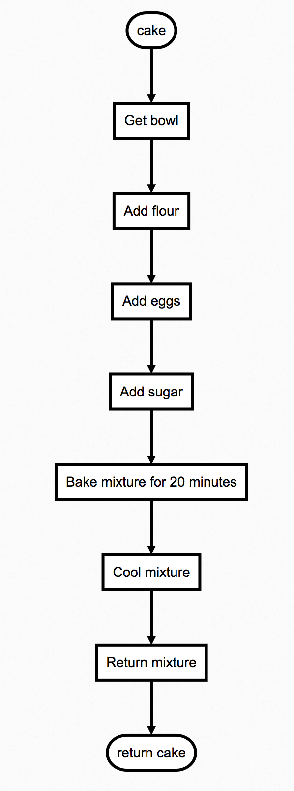
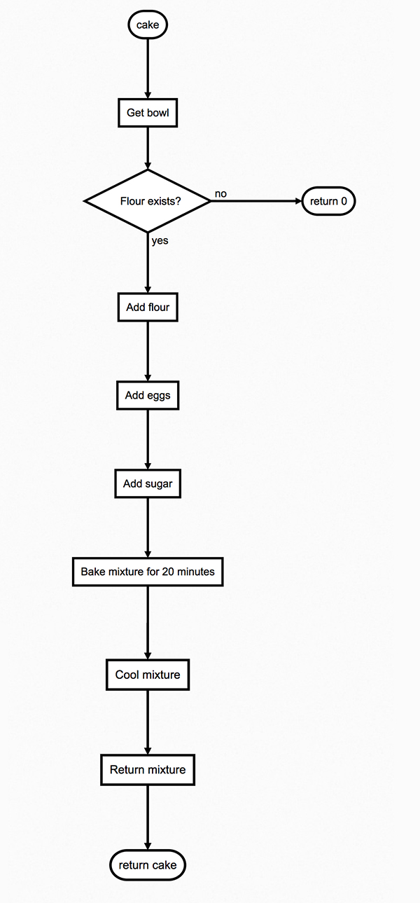
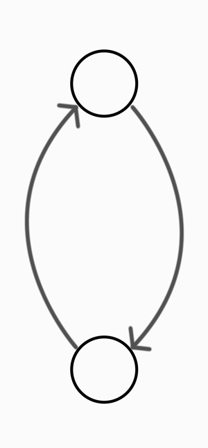

# Flow of Control

We already know that when we start a Ruby program, some **objects** are made for us.


In [module 2](../chapter2/README.md), we saw that integer objects were ready and waiting for us whenever we set up the Ruby world. And, we **assigned** these pre-existent numbers to **variables**: in other words, we gave them programmer-friendly **names**.

In [module 3](../chapter3/README.md), we found out that we could instruct objects to do things using **messages**. Objects might require **arguments** to be able to answer a message. We learned that the list of messages we can send to an object is called its **interface**. We saw that you could make a good guess at what an object was, based on the **methods** defined on its interface. We also saw that you can **chain** messages, thanks to **referential transparency**.

> **Messages** call **methods** on an object's **interface**.

So far, we've looked a lot at what exists in the program world \(objects\), and how those things communicate \(messages\). But our understanding of how messages are handled by methods is fuzzy. What happens _inside_ object methods?

## Going inside methods

Methods contain pre-written instructions – **procedures** – for their object to do.

Just as we have used line-by-line instructions to control our program world \(and objects in it\), so object methods contain pre-written lines of instructions to control their objects, and everything inside them. You could think of them as being 'programs within programs'.

We can cause an object to execute a procedure by _calling a method_ defined on that object. We call methods by sending objects messages.

> If we don't designate an object to send a message to, and just send a message, we send that message to the main object. The main object will happily carry out procedures, like any other object.

## What's a procedure?

Let's say we're an object in the program world. We want a cake: but we don't know how to bake the cake. Fortunately, there's another object in this world, `dad`, that does know how.

So, we send `dad` a message: "Hey Dad, can you bake me a cake?". Maybe we ask this a lot \(and we're rude\), so we'll just shorten the message we send to `cake`. When `dad` receives the `cake` method, he immediately executes his stored procedure. That procedure looks something like this:

1. Get bowl.
2. Add flour.
3. Add eggs.
4. Add sugar.
5. Bake mixture for 20 minutes.
6. Cool mixture.
7. Return mixture.

Dad goes off and does that, and once he's done, he `return`s the cake to us. Let's represent that as a flowchart:



> Procedures can be thought of as cooking recipes, which contain steps to produce a result.

Here's a code-y version of what `dad` just did. I'm using a bunch of program structures we'll see later: don't sweat it if this makes only vague sense to you right now:

```ruby
bowl = []
bowl.push(flour)
bowl.push(eggs)
bowl.push(sugar)

mixture = bowl.contents
mixture.bake

return mixture
```

> The keyword `return` says "whatever follows is the return value from this procedure". More on this further down.

## Conditional procedures

Procedures are about more than just unquestioningly executing one set of instructions.

What happens if `dad` tries to execute his `cake` procedure without any flour? It might just blow up, and crash Dad. Or worse: Dad might keep trying to make the cake without having any flour, resulting in an eggy, sugary mess \(or, at best, some sort of meringue\).

We'd like Dad to be able to stop his procedure if he doesn't have any flour. And we'd like him to give us a return value in this case \(maybe `0`, representing an 'error code' we agreed with him earlier\), so we know what's gone wrong. Let's amend the first few parts of the procedure:

1. Get bowl.
2. _If flour exists_ add flour.
3. _If flour exists_ add eggs.
4. _If flour exists_ add sugar.
5. _If flour exists_ bake mixture for 20 minutes.
6. _If flour exists_ cool mixture.
7. _If flour exists_ return mixture.
8. _If flour does not exist_ return `0`.

Instructions 2 through 8 will now only be executed by Dad if flour exists. If flour doesn't exist, he'll jump straight to step 9, and return `0`. Since we know what `0` means when we ask Dad to `cake` \(it means there's no flour\), we can make a decision about what to do next. Here's the new flowchart:



These sorts of 'conditional' procedures are how the majority of objects – and hence the majority of programs – work. Depending on things happening, or not happening, programs can do different things.

> Conditional procedures depend on the outcome of a **condition**. Here, the condition is 'does flour exist?'

Let's investigate a more code-oriented example. How does `1` know to return `true` here?

```eval-ruby
1.positive?
```

And yet `-1` knows to return `false`?

```eval-ruby
-1.positive?
```

There must be some procedure inside the `positive?` method defined on integer objects. This procedure determines whether to return `true`, or `false`. Let's go inside the `positive?` method defined on the interface of `1`:


Inside `1`'s `positive?` method is a procedure something like this:

```ruby
if self > 0
  return true
else
  return false
end
```

So what the heck do these instructions do?

## Writing Conditionals

Let's identify the parts of this code:

* `if` is an instruction to look at the statement that follows. If that statement returns anything _not false_, the instructions following it are executed. If the statement returns anything _false_, look for an `else`, and execute the instructions following that instead.
* `self` is the object in which this procedure will be executed \(i.e. the object on which this method is defined\). In this case, since we're 'inside' `1`, `self` is `1`.
* `self > 0` is a statement comparing `self` with `0`. It's: 
  * `true` if `self` is greater than `0`. 
  * `false` if `self` is less than or equal to `0`.
* `end` says "OK, return to executing every line after this one as normal, thanks."

There are two ways this code could be executed.

* If the `if` way is executed, the procedure will `return true`. 
* If the `else` way is executed, the procedure will `return false`. 

Each possibility is called a **branch**. The object must make a choice as to which branch should be executed, depending on the return value of the statement `self > 0`. The return value of this statement depends only on the value of `self`: that is, the value of the object executing the procedure.

> A structure that tells an object to 'do one thing or the other' is called a **conditional**. `if`/`else` is a conditional. The statement which determines which branch the object proceeds down is called a **condition**. Here, `self > 0` is the condition.

## Working out which branch gets executed

Let's depict the contents of the `positive?` method as a flow chart, and simplify the chart in the way the object does.


Since we're currently inside a method defined on the object `1`, we can use referential transparency to replace `self` with `1`. That gives us:

```ruby
if 1 > 0
  return true
else
  return false
end
```


Next, we can use referential transparency again, to replace the statement `1 > 0` with its return value, `true`:

```ruby
if true
  return true
else
  return false
end
```

Let's update the flow chart, with the obvious conclusion of the flow:


> This kind of process, replacing statements and names via referential transparency, is the first key skill in **computational thinking**.

So, when the program world runs the instructions within `1` \(i.e. with `self` set to `1`\), the result is:

```eval-ruby
if 1 > 0
  return true
else
  return false
end
```

And that's how `positive?` works.

> Ruby will translate code statements like `if 1 < 0; else...` into something very similar to the flowchart we made: an [Abstract Syntax Tree](https://en.wikipedia.org/wiki/Abstract_syntax_tree). Being able to deconstruct code into similar structures – whether you verbalise them, draw them out, or something else – is a crucial part of learning to work with code.

## Control Flow

The order in which an object executes instructions is called the **control flow**. We've just met one way of controlling this order: using a conditional to control which instructions get executed and which don't. There are other ways to adjust the control flow: we'll meet them in a minute.

* _**Imagine you are a program object. Imagine also that these instructions are defined a method defined on you. Draw out flow charts for the control flow of these instructions. You should be able to guess the comparison operators. Your aim is to use referential transparency to replace the instructions, chunk-by-chunk, until your flowchart looks like the last one we made.**_

```ruby
if 1 + 2 > 2
  return true
else
  return false
end
```

```ruby
if -1.negative?
  return true
else
  return false
end
```

```ruby
if -1.negative?
  return 150
else
  return 0
end
```

```ruby
if false
  return 2 + 8
else
  return 1.integer?
end
```

## More complex conditional procedures

So far, we've seen conditionals with the simplest possible procedures on their branches: procedures that just `return` a value depending on the truthiness or falsiness of some condition:

```eval-ruby
if 1 > 0
  return true
else
  return false
end
```

In the last example you drew out above, you saw that these 'conditional procedures' could be statements, too:

```ruby
if false
  # look, a statement!
  return 2 + 8
else
  # another statement!
  return 1.integer?
end
```

The truth is: a procedure inside a conditional can be as simple or as complex as you like. For instance, you can assign names within conditional procedures:

```eval-ruby
a = 10

if a.integer?
  a = a * -1
  return a
else
  return a.to_f
end
```

You could write further conditionals within conditional procedures \(although this can get confusing pretty quickly\):

```eval-ruby
if 1 > 0
  if 2 < 0
    return true
  else
    return 0
  end
else
  return 15
end
```

It's even commonplace to make calls to other objects within conditional procedures:

```ruby
cake = dad.cake

if cake.zero?
  flour.buy
  dad.cake
else
  self.feed(cake)
end
```

If there are more than two possible branches, you can use an `elsif` statement in between an `if` and an `else`:

```eval-ruby
number = 0

if number.positive?
  return true
elsif number.negative?
  return false
else
  return 0
end
```

Finally, it's perfectly OK to have an `if` statement without an `else`:

```eval-ruby
number = 1

if number.positive?
  return number
end
```

> Play with each of the examples in the REPL above until they make sense. You can always refresh the page if you messed something up!

## Writing conditions: Comparison

Here are the sorts of conditions we might meet in a program:

* If the stock of products is less than 100, order more products.
* If this password matches the password on record, log the user in.
* If the player's score is greater than or equal to 501, they win.
* If the user has no more money, kick them off the table.

These sorts of conditions are known as **comparison** conditions, because they compare one thing with another.

We've just met the comparison operators `>` and `<`. Here are the rest:

```
==
!=
=>
<=
```

* _**Play with the code example below to figure out which comparison operator means what.**_

```eval-ruby
1 > 0
```

> Comparison operators are methods defined on, among other things, integers. Don't believe me? Try changing `1 > 0` to `1.>(0)` in the code example above.

## Writing conditions: Logical operations

What the heck are these things `true` and `false`, anyway?

They're objects, of course! And, like `1`, `2`, `3`, and all the other integers, they have meaning in the program world. They represent _boolean values_. `true` and `false`:

* Know about the truth or falsity of things, and
* Know how to interact with each other.

`true` and `false` are used to do logic: often, to manage the control flow.

Here are some logical conditions we might meet in a program:

* If the user logs out and their cart isn't empty, send them an email to log back in and buy stuff.
* If the player is bankrupt or the player is out of pieces, send them a 'you lose!' message.
* If the user is not logged-in and a member, don't show them the member's area.

In Ruby, the logical operators include:

```
&&
||
!
```

* _**Play with the code example below to figure out which logical operator means what.**_

```eval-ruby
!true
```

> Are logical operators methods? On which objects are they defined?

## Manually managing control flow with parentheses

_Generally speaking_, an object will evaluate statements in parentheses `()` before any other statement in an instruction:

```eval-ruby
!true && false
```

```eval-ruby
!(true && false)
```

> If these two examples are confusing you, use referential transparency to replace each part of the line.

Here's another example:

```eval-ruby
2 * 3 + 2
```

```eval-ruby
2 * (3 + 2)
```

## Repeating instructions

So far we've met one way of managing the control flow for an object: conditionals.


What about if we wanted to do a different kind of instruction? One where we don't want the object to skip instructions in a program branch: we want it to _repeat_ instructions.

Let's imagine an object that prints `1` to the console forever:

```ruby
eternal_printer.print_1_forever
```

Here's how the procedure inside the `print_1_forever` method defined on `eternal_printer` might look:

```ruby
while true do
  puts 1
end
```

The code above will output 1, forever. The procedure – `puts 1` – will keep being called. That's because every time the `eternal_printer` object reaches the `end` statement, it'll jump back up to the `while true` statement:



> Notice that we wrap the procedure, `puts 1`, in a `do...end` structure. This is a structure that Ruby uses to formally designate a procedure. We don't use it with `if`, but we do with most other control flows. It's actually optional for `while`, but I suggest using it for clarity. The takeaway is "everything between `do` and `end` is a procedure".

Of course, the `eternal_printer` object being stuck in such an _infinite loop_ isn't usually that helpful – we probably want the object to quit its loop at some point, so we can set it to executing other program instructions.

> In Ruby, only one object can run procedures at a time. Since an object executing a procedure in a `while true` loop will just keep repeating the procedure forever, this means that your whole Ruby program will never do anything else. Unless the procedure has some kind of output – like printing to the console – this will give the appearance of your program 'freezing'!

Fortunately, Ruby gives us a way to exit from a `while` loop:

```ruby
while true do
  puts 1
  break
end
```

This `break` keyword will jump out of the loop. The object will execute the procedure line-by-line:

* `while true do`: Set up a `while` loop. Keep it going forever. Run the procedure inside the loop.
* `puts 1`: Print `1` to the console.
* `break`: Exit the loop.

Anything _after_ a `break` won't be executed by an object. In the example below, `2` will never be printed, because the instruction to do so comes after the instruction to `break` out of the loop.

```ruby
while true do
  puts 1
  break
  puts 2
end
```

#### Using `while` and `break` to make games

This sort of structure – `while true` with `break` – is especially useful for making games. It's especially powerful when combined with a conditional `break`: that is, a `break` that only happens under certain conditions. A regular condition for this kind of conditional `break` is the existence of a winner.

Let's imagine that we have a `game` object with a method, `start`:

```ruby
game.start
```

Inside the `start` method, there might be a procedure like this:

```ruby
while true do
  # run a method on a player object
  player_1.play
  # run a method on the other player object
  player_2.play

  # wins? is another method on player object, that returns true if they won
  if player_1.wins?
    break
  elsif player_2.wins?
    break
  end
end
```

> If both `player_1.wins?` and `player_2.wins?` is false, the `break` will not be executed, returning to the top of the loop so both players can play again. Each time `game` passes through the loop is a 'turn'.

Most games are built around loops, with some 'break' condition being 'the end of the game':

* **Chess** is a loop that alternates turns between users forever, and `break`s when there is checkmate or stalemate.

```ruby
chess.start
```

Inside the `start` method defined on the `chess` object:

```ruby
while true do
  player_1.play
  player_2.play

  if checkmate || stalemate
    break
  end
end
```

* **Monopoly** is a loop that alternates turns between users forever, and `break`s when there is only one non-bankrupt player left.

```ruby
monopoly.start
```

Inside the `start` method defined on the `monopoly` object:

```ruby
while true do
  player_1.play
  player_2.play
  player_3.play

  if only_one_non_bankrupt_player_left
    break
  end
end
```

> `only_one_non_bankrupt_player_left` could be another method defined on the `monopoly` object.

* **Football** is a loop that kicks a ball around between teams, accumulating goals, and `break`s when 90 minutes have passed.

```ruby
football_game.play
```

Inside the `play` method defined on the `football_game` object:

```ruby
while true do
  thierry_henri.kick_ball
  eric_cantona.maybe_score_goal

  if ninety_minutes_passed
    break
  end
end
```

> `ninety_minutes_passed` could be another method defined on the `football_game` object.

When being tasked with making a game, one of your first questions should be "what happens each game loop? And what's the break condition?".

> Simply by inventing new answers to these questions, new games are born. Invent one!

#### Using accumulators

An object might want to keep track of some value during a `while` loop. The object can't just define a variable inside the loop:

```ruby
while true do
  goals_scored = 0

  if eric_cantona.score_goal
    goals_scored = goals_scored + 1
  end
end
```

Because each time the loop runs, the variable will be reset to its initial value. No matter how many times `eric_cantona` scores a goal, `goals_scored` will always be reset to `0`.

If we want to keep track of a value during a loop, we have to declare a variable outside of the loop:

```ruby
my_number = 0

while true do
  my_number = my_number + 1

  puts my_number
end
```

Each time the `while` loop above runs:

* `my_number = my_number + 1`: `my_number` will increase in value by `1`.
* `puts my_number`: `my_number` will be printed to the console.

In short: `my_number` will count upwards, forever. So how about if we just wanted to print out the first ten numbers, then stop?

```ruby
my_number = 0

while true do
  my_number = my_number + 1
  puts my_number

  if my_number == 10
    break
  end
end
```

Now that we've added the conditional, each time the `while` loop above runs the object does the following:

* `my_number = my_number + 1`: increase the value of `my_number` by `1`.
* `puts my_number`: print `my_number` to the console.
* `if my_number == 10`: only execute the following procedure if `my_number` is equal to `10`.
* `break`: if the above condition was met, exit the loop.

This technique is called using an **accumulator**. The accumulator 'keeps track' of what's going on in the `while` loop, and allows the object to exit the loop in certain conditions. Our accumulator above keeps track of how many times the `while` loop has run.

#### `while` loop conditions

We've seen that an object can execute procedures in a `while` loop forever, if we tell it to run `while true`. How about if we tell it to run `while something else`?

```
while false do
  puts 1
end
```

The while loop above will never run at all: `while` loops are dependent on _conditions_.

By using an accumulator, we can tell an object executing the following while loop to print the integers 1 to 10 to the console, then to quit the loop.

```ruby
number = 0

while number <= 10 do
  number = number + 1
  puts number
end
```

* _**Using a while loop, instruct the main object to print the numbers 10 to 100 to the console.**_

I'd recommend building your `while` loops with `break`s until you're familiar with how they work, then seeing if you can turn those loops into conditional ones.

## `return`

`return` says to an object:

* Stop from executing this procedure. 
* Return this value as the 'return value' from the procedure. 

It's typically used inside a method, to say "this is what should come back from calling this method". However, we can use it to manage the control flow: because _instructions after a return will never be executed_:

```ruby
if true
  puts 1
  return 0

  puts 2
end
```

Breaking down the control flow line-by-line, these are instructions to the main object as follows:

* `if true`: Always execute the following branch.
* `puts 1`: Print `1` to the console.
* `return`: Stop execution here, return `0` to the object that called you \(if that's a REPL, return `0` to the REPL\)

Notice that I didn't even write the instruction to `puts 2`. That's because it never gets executed, because `return` stopped the main object from executing any further parts of the procedure.

* _**Play with the code example below. Can you make it return **_`b`_**, instead of **_`a`_**?**_

```eval-ruby
if true
  a = 1
  return a

  b = 2
  return b
end
```

## Combining flows of control

The majority of code for managing control flow combines loops and conditionals. Here's a simple example, instructing the main object to print only even numbers under 101 to the console:

```ruby
number = 1

while number < 101 do
  if number.even?
    puts number
  end

  number = number + 1
end
```

* _**Instruct the main object to print only odd numbers under 100 to the console.**_

## Random conditionals

Last module, we met `rand`, which generates random numbers. We can use it in conditionals if we want objects to execute random branches. This simulates random behaviour:

```eval-ruby
random_number = rand(10)

if random_number < 5
  return 0
else
  return 10
end
```

We can use `rand` to, for example, write a simple dice game. \(Game! You're probably going to need a loop of some sort.\) The rules are:

1. If I roll higher than my opponent, I win.

Let's agree now that the program returning `false` means 'I lose', and `true` means 'I win'.

* _**Write the dice game as above.**_
* _**Upgrade the dice game: now both I and my opponent roll two six-sided dice each.**_
* _**Upgrade the game once more: now we play several rounds for each game.  The first player to win two rounds wins the game. \(Still with two dice each.\)**_

## Complete the mastery quiz for chapter 4

Use your mastery quizzes repository to complete the quiz for chapter 4.

