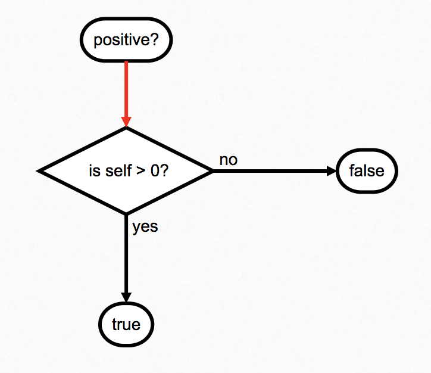
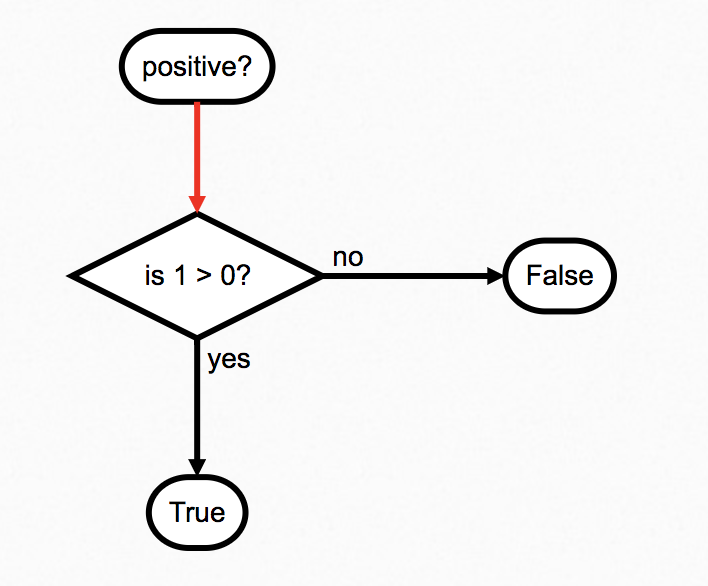
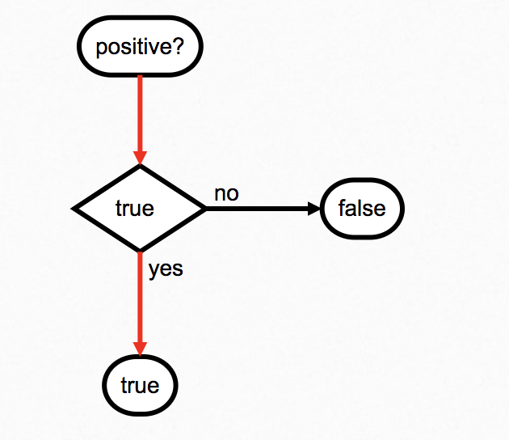

# Flow of Control

We already know that when we start a Ruby program, some **objects** are made for us.


In [module 2](../chapter2/README.md), we saw that integer objects were ready and waiting for us whenever we set up the Ruby world. And, we **assigned** these pre-existent numbers to **variables**: in other words, we gave them programmer-friendly **names**.

In [module 3](../chapter3/README.md), we found out that we could instruct objects to do things using **messages**. Objects might require **arguments** to be able to answer a message. We learned that the list of messages we can send to an object is called its **interface**. We saw that you could make a good guess at what an object was, based on the **methods** defined on its interface. We also saw that you can **chain** messages, thanks to **referential transparency**.

> **Messages** call **methods** on an object's **interface**.

So far, we've looked a lot at what exists in the program world (objects), and how those things communicate (messages). But our understanding of how messages are handled by methods is fuzzy. What happens _inside_ object methods?

## Going inside methods

Methods contain pre-written instructions – **procedures** – for the computer. Just as we have used instructions – line-by-line – to control our program world and everything in it, so object methods contain pre-written lines of instructions to control themselves, and everything inside them. We can cause the object to execute its procedure by sending it a message with the same name as the method that contains that procedure.

For example, let's say we're an object in the program world. We want a cake: but we don't know how to bake the cake. Fortunately, there's another object in this world, `dad`, that does know how.

So, we send `dad` a message: "Hey Dad, can you bake me a cake?". Maybe we ask this a lot (and we're rude), so we'll just shorten the message we send to `cake`. When `dad` receives the `cake` method, he immediately executes his stored procedure. That procedure looks something like this:

1. Get bowl.
2. Add flour.
3. Add eggs.
4. Add sugar.
5. Bake mixture for 20 minutes.
6. Cool mixture.
7. Return mixture.

Dad goes off and does that, and once he's done, he `return`s the cake to us. Let's represent that as a flowchart:


## Conditional procedures

Procedures are about more than just executing one set of instructions, though. Right now, `dad`'s `cake` procedure can't handle, say, not having any flour. It'll just blow up and crash – or worse, Dad will keep trying to make the cake without having any flour, resulting in an eggy, sugary mess (or, at best, some sort of meringue).

We'd like Dad to be able to stop his procedure if he doesn't have any flour. And we'd like him to `return` something to us in this case (maybe `0`, representing an 'error code' we agreed with him earlier), so we know what's gone wrong. Let's amend the first few procedures:

1. Get bowl.
2. IF flour exists, add flour.
3. IF flour exists, add eggs.
4. IF flour exists, add sugar.
5. IF flour exists, bake mixture for 20 minutes.
6. IF flour exists, cool mixture.
7. IF flour exists, return mixture.
8. IF flour does not exist, return `0`.

Steps 2 through 8 will now only be executed by Dad if flour exists. If flour doesn't exist, he'll jump straight to step 9, and return `0`. Since we know what `0` means when we ask Dad to `cake` (it means there's no flour), we can make a decision about what to do next. Here's the new flowchart:


These sorts of 'conditional' procedures are how the majority of programs work. Depending on things happening, or not happening, programs can do different things.

> Conditional procedures depend on the outcome of a **condition**. Here, the condition is 'does flour exist?'

Let's investigate a more code-y example. How does `1` know to return `true` here?

```eval-ruby
-1.positive?
```

And `-1` knows to return `false`?

```eval-ruby
-1.positive?
```

Let's go inside the `positive?` method defined on the interface of `1`:

<animation showing 'going into' the method defined on these interfaces and seeing some instructions>

Inside `1`'s `positive?` method is a procedure something like this:

```ruby
if self > 0
  return true
else
  return false
end
```

So what the heck do these instructions do?

## Writing Conditionals

Let's identify the parts of this code:

- `self` is the object that the instructions are within (i.e. the object on which this method is defined). In this case, since we're 'inside' `1`, `self` is `1`.
- `self > 0` is a statement comparing `self` with `0`. It's: 
  - `true` if `self` is greater than `0`. 
  - `false` if `self` is less than or equal to `0`.
- `if` is an instruction to look at the following statement. If it's _not false_, execute the following instructions. If it _is false_, look for an `else`, and execute the instructions following that instead.
- `end` says "OK, return to executing every line as normal, thanks."

There are two ways this code could be executed. In one situation, the computer will `return true`. In the other, the computer will `return false`. The computer must make a choice, depending on the value of `self`.

> A structure that tells a program to 'do one thing or the other' is called a **conditional**. `if`/`else` is a conditional. The statement which determines which 'branch' the program proceeds down is called a **condition**. Here, `self > 0` is the condition.

Let's depict the contents of the `positive?` method as a flow chart, and simplify the chart in the way the computer does.



Since we're currently inside `1`, we can use referential transparency to replace `self` with `1`. That gives us:

```ruby
if 1 > 0
  return true
else
  return false
end
```



Next, we can use referential transparency again, to replace the statement `1 > 0` with its return value, `true`:

```ruby
if true
  return true
else
  return false
end
```

Update the flow chart, with the obvious conclusion of the flow:



> This kind of process, replacing statements and names via referential transparency, is the first key skill in **computational thinking** (aka, thinking like a computer).

So, when the program world runs the instructions within `1` (i.e. with `self` set to `1`), the result is:

```eval-ruby
if 1 > 0
  return true
else
  return false
end
```

And that's how `positive?` works.

> This process might seem laborious, but I'm trying to get you to think like the computer. In fact, Ruby will translate code statements like `if 1 < 0; else...` into something very similar to the flowchart we made: an [Abstract Syntax Tree](https://en.wikipedia.org/wiki/Abstract_syntax_tree). Being able to deconstruct code into similar structures – whether you verbalise them, draw them out, or something else – is a crucial part of learning to work with code.

The idea of _controlling which instructions get executed and which don't_ is called the **control flow**. There are other ways to adjust the control flow: we'll meet them in a minute.

- _**Draw out flow charts for the following sets of instructions. You should be able to guess the comparison operators. Your aim is to use referential transparency to replace the instructions, chunk-by-chunk, until your flowchart looks like the last one we made.**_

```ruby
if 1 + 2 > 2
  return true
else
  return false
end
```

```ruby
if -1.negative?
  return true
else
  return false
end
```

```ruby
if -1.negative?
  return 150
else
  return 0
end
```

```ruby
if false
  return 2 + 8
else
  return 1.integer?
end
```

## More complex conditional procedures

So far, we've seen conditionals that contain the simplest possible procedures: `return` a value depending on the truthiness or falsiness of some _condition_. 

In the last example above, we saw that these conditional procedures could be statements, too:

```ruby
if false
  # look, a statement!
  return 2 + 8
else
  # another statement!
  return 1.integer?
end
```

The truth is: a procedure can be as simple or as complex as you like. For instance, you could write very complex conditionals:

```eval-ruby
if 1 > 0
  if 2 < 0
    return true
  else
    return 0
  end
else
  return 15
end
```

You can assign names within procedures within conditionals:

```eval-ruby
a = 10

if a.integer?
  a = a * -1
  if a.positive?
    return a
  else
    b = 2 + 2
    return b
  end
else
  return a.to_f
end
```

It's even commonplace to make calls to other objects within conditionals:

```ruby
cake = dad.cake

if cake.zero?
  flour.buy
  dad.cake
else
  self.feed(cake)
end
```

Finally, it's perfectly OK to have an `if` statement without an `else`:

```eval-ruby
number = 1

if number.positive?
  return number
end
```

## Comparison operators

We've seen the comparison operators `>` and `<`. Here are the rest:

```
>
<
==
=>
<=
```

Play in the REPL below to figure out which one means what.

```eval-ruby
1 > 0
```

## `true` and `false`

What the heck are these things `true` and `false`, anyway?

They're objects, of course! And, like `1`, `2`, `3`, and all the other integers, they have meaning in the program world. They represent _boolean values_ in Ruby. `true` and `false`:

* Know about the truth or falsity of things, and
* Know how to interact with each other.

`true` and `false` are used to do logic: often, to manage the control flow. 

In Ruby, the logical operators include: 

```
&&
||
!
```

Play in the REPL below to figure out what they mean:

```eval-ruby
!true
```

## Parentheses

_Generally speaking_, Ruby will evaluate things in parentheses `()` before anything else in a line:

```eval-ruby
!true && false
```

```eval-ruby
!(true && false)
```

> If these two examples are confusing you, use referential transparency to replace each part of the line.

Here's another example:

```eval-ruby
2 * 3 + 2
```

```eval-ruby
2 * (3 + 2)
```

## Repeating instructions

So far we've met one way of controlling the flow of information in a program: conditionals.


What about if we wanted to do a different kind of instruction? One where we don't want the computer to skip instructions: we want to repeat them.

```ruby
while true
  puts 1
end
```

The code above will output 1, forever. The procedure – `puts 1` – will keep being called. That's because every time the computer reaches the `end` statement, it'll return to the `while true` statement:


Of course, being stuck in such an _infinite loop_ isn't usually that helpful – we want to quit the loop at some point, so we can keep on executing other instructions in the program.

Again, `while` loops are dependent on _conditions_. This while loop will never run at all:

```
while false
  puts 1
end
```

And this while loop will print the integers 1 to 10 to the console before quitting the loop:

```ruby
number = 1

while 1 <= 10
  puts number
  number = number + 1
end
```

- _**Using a while loop, print the numbers 10 to 100 to the console.**_

## Combining flows of control

The majority of _flow of control_ combines loops and conditionals. Here's a simple example, that prints only even numbers under 101 to the console:

```ruby
number = 1

while number < 101
  if number.even?
    puts number
  end

  number = number + 1
end
```

- _**Write a program that prints only odd numbers under 100 to the console.**_
